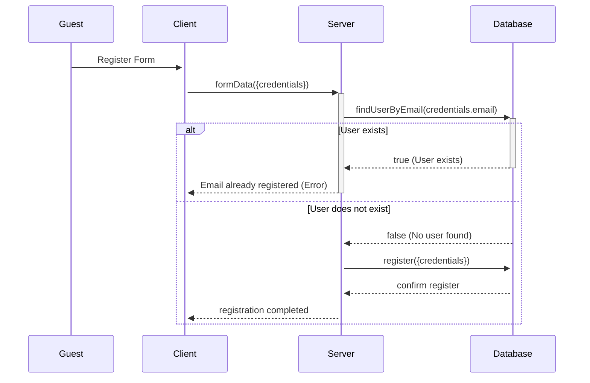
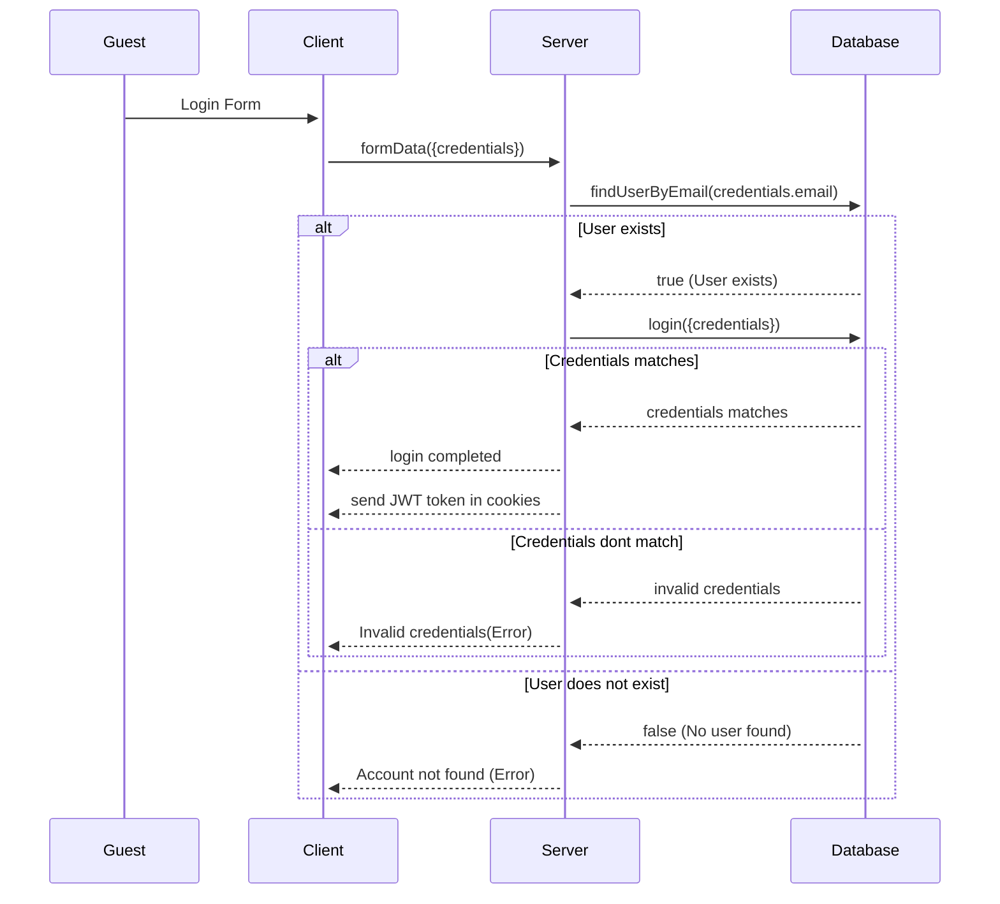
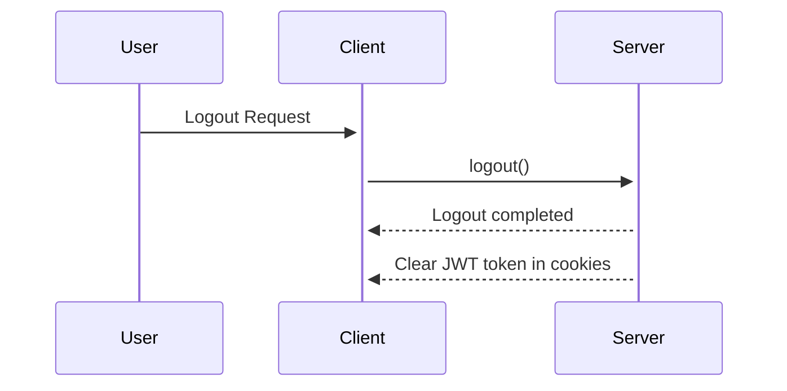

# Sequence Diagrams

## Table of Contents

1. [Registration Sequence](#registration-sequence)
2. [Login Sequence](#login-sequence)
3. [Logout Sequence](#logout-sequence)

---

## Registration Sequence

[Back to Top](#table-of-contents)

## Login Sequence

[Back to Top](#table-of-contents)

## Logout Sequence

[Back to Top](#table-of-contents)

