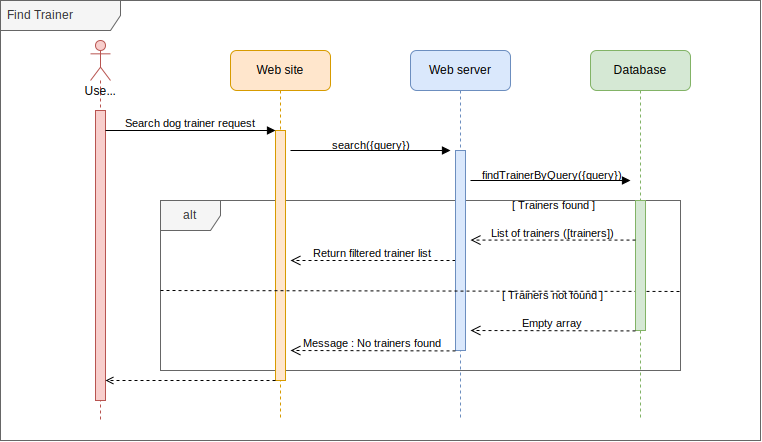
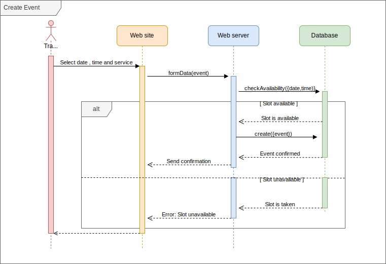
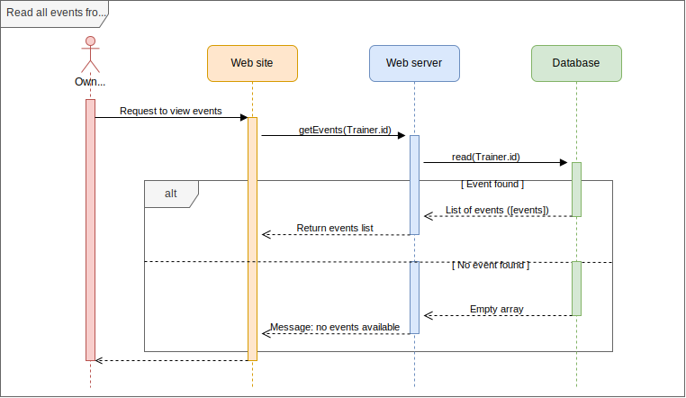
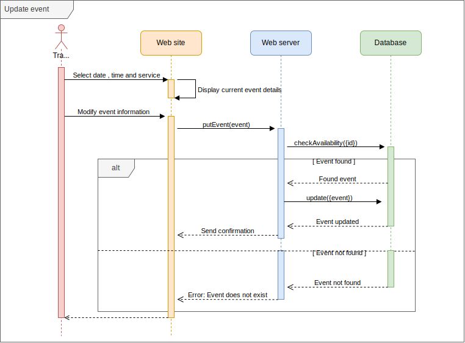
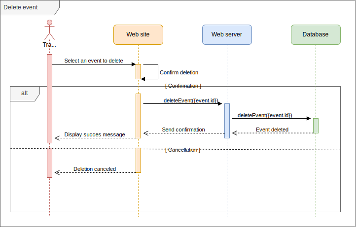

# Sequence Diagrams

## Table of Contents

### Authentification

1. [Registration Sequence](#registration-sequence)
2. [Login Sequence](#login-sequence)
3. [Logout Sequence](#logout-sequence)

### Visitor functions

1. [Find Trainer Sequence](#find-trainer-sequence)

### Appointment booking

1. [Create Appointment Sequence](#create-appointment-sequence)
2. [Read Appointment Sequence](#read-appointment-sequence)
3. [Update Appointment Sequence](#update-appointment-sequence)
4. [Delete Appointment Sequence](#delete-appointment-sequence)

---

## Registration Sequence

[Back to Top](#table-of-contents)

## Login Sequence

[Back to Top](#table-of-contents)

## Logout Sequence

[Back to Top](#table-of-contents)

---
---

## Find Trainer Sequence

[Back to Top](#table-of-contents)

---
---

## Create Appointment Sequence

[Back to Top](#table-of-contents)

## Read Appointment Sequence

[Back to Top](#table-of-contents)

## Update Appointment Sequence

[Back to Top](#table-of-contents)

## Delete Appointment Sequence

[Back to Top](#table-of-contents)

