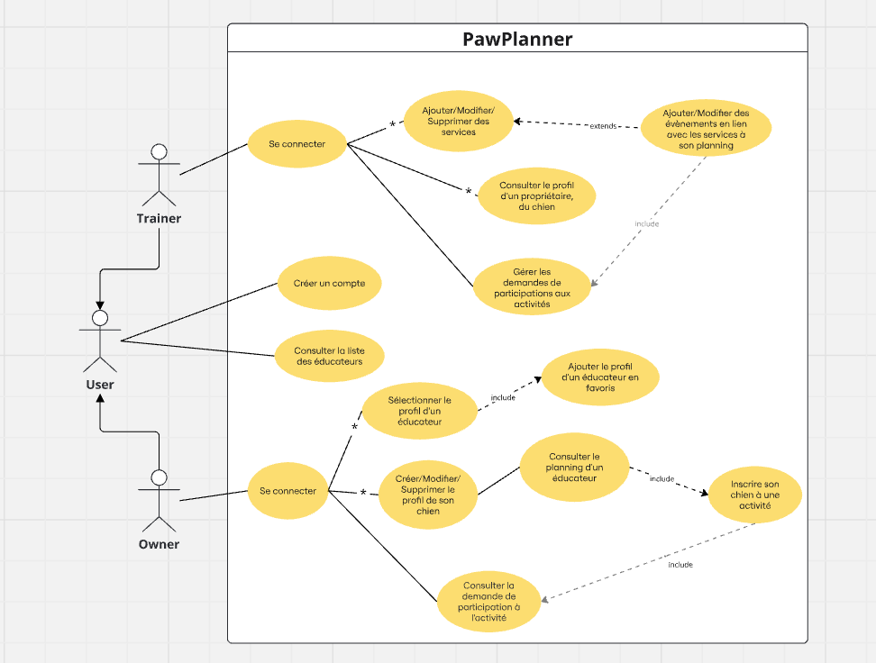

# UML Use Case diagram

##### The UML Use Case diagram for PawPlanner illustrates the interactions between trainer(s) and the app to schedule services, manage timetables, and allow owner to sign up for activities.

